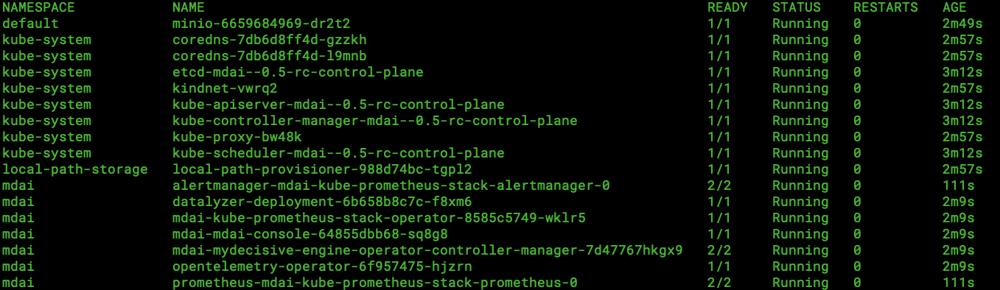

# Use Case: Compliance and Dynamic Filtering

## The tech stack
This sets up a cluster with the following technologies: 
- MDAI infra
- Fluentd
- MinIO


## What does this use case provide?

An end-to-end mocked example for collecting log data from services/infrastructure, stream processing and forwarding of that log data to either a compliance store or an `otlp-http` endpoint.

### Log data generation and forwarding

- Spins up small batches of log generators that will appear to send logs for 1001 services
  - Service with `service.name` attribute of `service9999` will be really noisy
  - More can be spun up using the `example_log_generator` manifests

### Compliance
- All data collected will be filtered down to ERROR/WARNING logs and stored in MinIO.
  - MinIO can be accessed for verification of logs at rest

### Dynamic Filtering
- Filters any service's INFO logs that sends more than 5MB in the last 6 minutes


## Setup

### Create a new cluster via kind

*Note: you will need kind and docker installed to run the following step*

```sh
kind create cluster --name mdai--0.5-rc
```
## Add helm repos

```sh
# add MinIO
helm repo add minio https://charts.min.io/

# add Fluent
helm repo add fluent https://fluent.github.io/helm-charts

# update helm repo
helm repo update
```

## Install min.io

```sh
helm install minio minio/minio --values values_minio.yaml
```

### Install MDAI without cert-manager 

*If you have already done this from our [Installation steps](../README.md#without-cert-manager) feel free to skip to the next step.*

```sh
helm upgrade --install --create-namespace --namespace mdai --cleanup-on-fail --dependency-update --wait-for-jobs -f values.yaml -f values_prometheus.yaml mdai .
```

### Validate 

You can verify that your pods are all up and running with the following command

```sh
kubectl get pods -A
```

The output should look something like...


## Create and initialize log generators

**Generator 1** - a normal and consistent log generator for random number generated service names `service####`.

```sh
kubectl apply -f ./example_log_generator.yaml
```

You should be able to view the log output to validate the generation of logs.

<video controls src="../media/logs_normal.mp4"></video>

**Generator 2** - a noisy and excessive log generator of logs for a particular service (`service1234` unless changed)

```sh
kubectl apply -f ./example_log_generator_noisy_service.yaml
```

You should be able to view the log output to validate the generation of logs.

<video controls src="../media/logs_noisy.mp4"></video>

**Generator 3** - a noisy and excessive log generator of logs for a particular service (`service4321` unless changed)

```sh
kubectl apply -f ./example_log_generator_xtra_noisy_service.yaml
```

You should be able to view the log output to validate the generation of logs.

<video controls src=""></video>


## Create and use OTel collector for forwarding logs

> Note: must be in `mdai` namespace with the datalyzer

```sh
# add a collector definition 
kubectl apply -f ./example_collector.yaml --namespace mdai
```

## Install fluentd

```sh
helm install fluentd fluent/fluentd --values values_fluentd.yaml
```