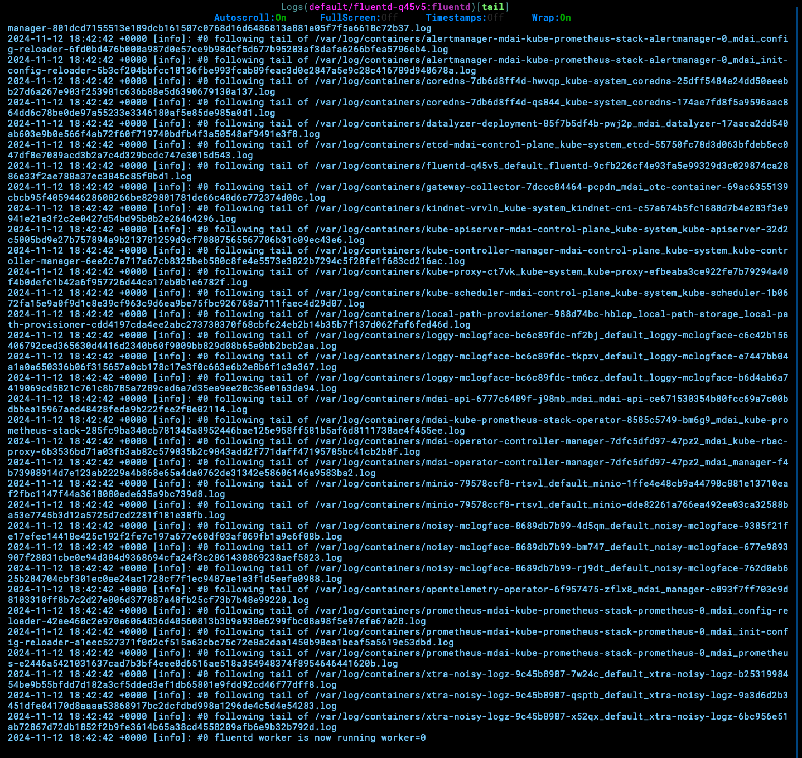

## Install fluentd

We will now use fluentD to send all logs from the mock data generators to the OTel collector. This will connect all the steps together at you'll finally be able to see telemetry flowing through your telemetry pipelines.

```sh
helm install fluentd fluent/fluentd --values values_fluentd.yaml
```

### Validate fluentD operations

You can review the logs for the fluentD pod to ensure operations are working as expected.



----

<br />
<br />

[Next step: Inspect data ➡](inspect_data.md)