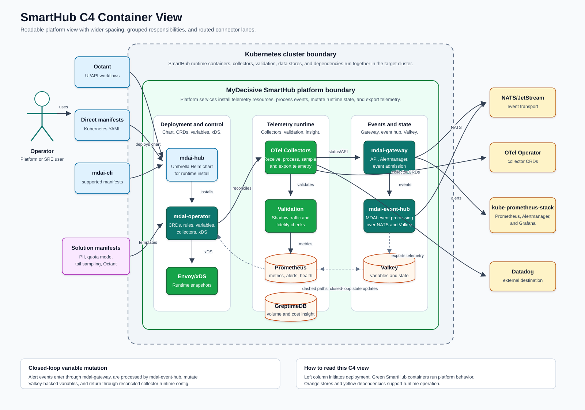

# SmartHub Architecture

SmartHub architecture explains what `mdai-hub` installs, which runtime components SmartHub owns, and how telemetry, validation, variables, and event-driven runtime state fit together.

## SmartHub C4 View

The C4 container view shows SmartHub as the platform layer that runs in Kubernetes. It separates setup entry points, SmartHub runtime components, data stores, and external dependencies.

## Platform Purpose

SmartHub provides the telemetry platform behind Octant, Kubernetes manifest, Helm, and `mdai-cli` operation:

- `mdai-hub` installs SmartHub runtime components and platform dependencies.
- `mdai-operator` reconciles CRDs, collector resources, rules, variables, validation resources, and runtime configuration.
- `mdai-gateway` provides API and webhook entry points for alerts, variables, integration secrets, and hub state access.
- `mdai-event-hub` processes SmartHub events over NATS and Valkey-backed state.
- OpenTelemetry collectors receive, process, sample, and export telemetry.
- Data Fidelity Validation checks telemetry flow, parity, and policy expectations.
- Prometheus, GreptimeDB, and Valkey support health metrics, insight data, and runtime state.

## Platform Interaction Paths

SmartHub can be operated through three paths:

| Path | Purpose |
| --- | --- |
| Octant web app and API | Guided workflows over SmartHub installation, connections, validation, settings, and Clarity. |
| Direct manifests | Reviewed Kubernetes manifests applied by platform operators or automation. |
| `mdai-cli` | Command-line SmartHub setup using supported manifests and published installation guidance. |

Octant provides the guided control-plane experience. Direct manifests and `mdai-cli` support teams that manage SmartHub through Kubernetes or command-line workflows.

## Runtime Responsibilities

SmartHub runtime responsibilities include:

- Installing platform dependencies and SmartHub services through `mdai-hub`.
- Reconciling OpenTelemetry collector configuration.
- Managing hub variables and runtime state.
- Processing events from gateway and platform sources.
- Rendering alert rules and consuming Prometheus or Alertmanager events.
- Running validation checks that compare received and sent telemetry.
- Exporting telemetry to downstream destinations such as Datadog.

## Data and State

SmartHub stores and reads different kinds of data for different runtime needs:

| Store | Used for |
| --- | --- |
| Prometheus | Stream metrics, collector health, hub health, validation metrics, and alert inputs. |
| GreptimeDB | Telemetry insight, volume, and cost data used by SmartHub and Octant. |
| Valkey | Hub variables, event state, audit context, and runtime state. |

## Closed-Loop Runtime Flow

Closed-loop SmartHub behavior connects platform events to runtime configuration:

1. SmartHub defines alert rules and runtime variables through platform configuration.
2. Prometheus and Alertmanager produce events from telemetry and hub health.
3. `mdai-gateway` admits events into the SmartHub event system.
4. `mdai-event-hub` processes events and coordinates runtime actions.
5. `mdai-operator` reconciles variable and configuration changes.
6. Collectors consume updated runtime configuration and continue processing telemetry.

## Kubernetes Locality

SmartHub runtime components are modeled as co-located in the Kubernetes cluster. This includes collectors, validation, Prometheus, GreptimeDB, Valkey, gateway, event hub, operator-managed resources, and any development or demo workloads that are intentionally installed into the same environment.

## Related Pages

- [SmartHub Documentation](index.md)
- [SmartHub Quick Start](quickstart.md)
- [Development](development.md)
- [Octant](https://github.com/MyDecisive/octant)
- [docs.mydecisive.ai](https://docs.mydecisive.ai/)
