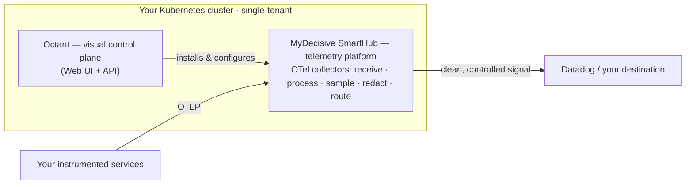

# MyDecisive SmartHub — Product Primer

**The telemetry platform that powers your observability pipeline.** It runs your OpenTelemetry collectors, controls the signal, and routes it — on the wire, inside your own Kubernetes cluster.

> **What this is — and isn't.** A ~5-minute explainer for developers, SREs, and platform engineers: what the SmartHub is, why you'd want it, and how it works with Octant. It is **not** a production deployment guide, a deep architecture reference, or a course on extracting every capability from the platform. When you're done you'll understand the pieces and be ready to install a hub on your laptop. Links throughout go deeper so this stays short.

## What is the SmartHub?

The MyDecisive SmartHub is the **Kubernetes-native telemetry platform** that runs your observability pipeline. At its core is the **OpenTelemetry collector foundation** that receives, processes, samples, and routes your logs, metrics, and traces — together with the platform services that manage it all.

Because it runs **on the wire, inside your own cluster**, the SmartHub controls your telemetry *before* it reaches (and bills against) your observability vendor:

- **Intelligent LogStream & Intelligent Trace Sampling** — keep the signal that matters, drop the noise, cut the downstream bill.
- **PII Redaction** — strip sensitive data at the source to enforce data sovereignty.
- **Data Fidelity Validation** — confirm telemetry is actually flowing, complete, and correct.
- **Closed-loop automation** — react to your live telemetry and adjust the pipeline automatically.

In-cluster **Prometheus**, **GreptimeDB**, and **Valkey** back the health metrics, cost/volume insight, and runtime state behind these capabilities. The result: you're back in control of your stack and your budget.

## What is Octant?

The SmartHub is the platform; **Octant is the visual control plane** that drives it — a web app and API that turns what is normally months of pipeline configuration into minutes of guided workflows (think Ubiquiti's Unifi, but for observability pipelines). From Octant you install the SmartHub and its collectors, create connections, save integrations (Argo CD, Datadog), validate telemetry flow, and tune volume, cost, and sampling with Clarity.

**Octant is the recommended way to operate the SmartHub** — the guided path most teams start with. For automation or advanced use, the SmartHub can also be driven directly:

| Path | What it's for |
| --- | --- |
| **Octant** *(recommended)* | A visual UI and API control plane — the standard way to install, configure, validate, and tune the SmartHub. |
| **Direct manifests** | Applying reviewed Kubernetes manifests directly, e.g. in your own GitOps automation. |
| **`mdai-cli`** | Command-line workflows using pre-canned manifests you adapt as needed. |

Start with Octant and grow into more of the platform's capabilities over time; its companion is the **Octant primer**.

## How the SmartHub and Octant work together

Two planes, one cluster:
- **SmartHub — the platform.** The runtime that runs the OpenTelemetry Collectors and platform services: it receives, processes, samples, redacts, and routes your telemetry.
- **Octant — the visual control plane.** The web app and API where you install, configure, validate, and tune the SmartHub.

They are **co-located in the same Kubernetes cluster.** Octant orchestrates the SmartHub's install, generates its pipeline and Kubernetes configuration, and reads stream/health/cost/volume state directly from the in-cluster platform. The SmartHub does the heavy lifting on your telemetry; every Octant capability depends on a SmartHub capability underneath it.



*Your services send telemetry (OTLP) into the SmartHub's collectors; the SmartHub controls it and forwards only what matters downstream. Octant is how you drive it.*

## Where it goes in your infrastructure

The SmartHub runs **inside your own Kubernetes cluster** (by default in the `mdai` namespace), single-tenant and dedicated to your traffic. It sits **in-line** between your instrumented services and your downstream observability vendor: your services send signal in through OpenTelemetry Collectors, the SmartHub processes and routes it, and your vendor (e.g. Datadog) receives the controlled stream. Telemetry is processed in your environment before anything is forwarded on. Octant, when used, runs alongside in the same cluster as the control plane.

## What to expect once it's installed

- A **running hub in about five minutes** in a ready Kubernetes environment.
- **OpenTelemetry Collectors receiving, processing, and routing** your signal — with real-time control over cost and volume.
- **Telemetry insight** — stream, health, cost, and volume data (Prometheus + GreptimeDB) you can see and act on.
- **Validated delivery** — Data Fidelity Validation confirms telemetry is flowing and complete to your destination.
- A **foundation for automation** — closed-loop workflows over your live stream.
- **Octant on top (recommended)** — put Octant's visual control plane over the hub to install, configure, validate, and tune it without hand-writing YAML.

What this doc *won't* give you is production hardening, sizing, and day-2 detail — that's in the installation and architecture guides.

## Get started — run it

In a ready Kubernetes environment, install a hub with `mdai-cli` (the intent is ~5 minutes):

```shell
mdai install
kubectl get pods --namespace mdai     # watch the SmartHub workloads come up
```

If your environment needs a values file or a local learning-cluster setup, follow the variant in the installation guide rather than inventing local overrides. Then put **Octant's visual control plane** on top — the recommended way to operate the hub day to day.

## Dive deeper

<!-- PRE-LAUNCH: confirm/swap public URLs below before publishing. -->

- **SmartHub & platform docs:** [docs.mydecisive.ai](https://docs.mydecisive.ai/)
- **Install the SmartHub locally:** [docs.mydecisive.ai/installation](https://docs.mydecisive.ai/installation/)
- **SmartHub — Helm chart & source:** [github.com/MyDecisive/mdai-hub](https://github.com/MyDecisive/mdai-hub)
- **Octant — control plane source & primer:** [github.com/MyDecisive/octant](https://github.com/MyDecisive/octant)

---

<sub>MyDecisive · SmartHub + Octant. This is an explainer, not a deployment or architecture guide — see the links above to go deeper.</sub>
